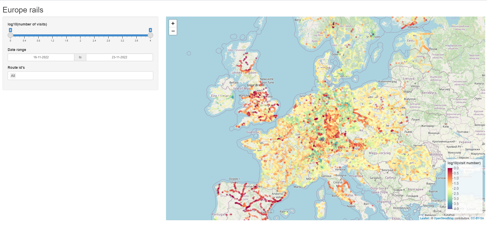
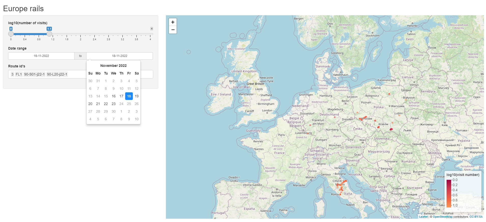

# Europe rails

Simple Shiny application written in R for interactive exploration of rail stops data in some European countries.

## Dataset

Used dataset comes from university group project: <https://gitlab.com/El_Kapitan/tricity-heat-map> that I took part in. It was aimed at finding places excluded from rail transport in European countries that distribute their transport data in GTFS format. As a demo the dataset was compiled for a week (16.11 - 23.11) in November 2022.

## Application

## Usage

To run this application you need to have R language and libraries:

-   shiny

-   dplyr

-   leaflet

-   RColorBrewer

The dataset is quite big (\~2.4 GB) and takes a while to process. After the default page is loaded and dots appear on map then you are ready to use available filters. The amount of visits of stops is coded in color of their dot (the space between rarely and frequently visited stops was very big e.g. 1 to 5000, so the color encoding works on log10 of number of visits). Map is fully interactive - you can zoom, move around and click on stops to get the popout displaying exact number of visits for this stop. The slider let's you filter range of visits. You can also filter dates of visits and select routes that you are interested in.

